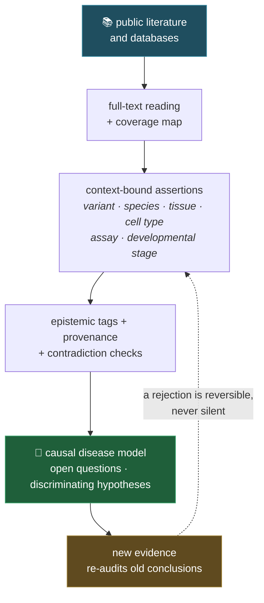

# LEGEND — Mechanistic Intelligence for Rare Disease

**A public-evidence framework that turns fragmented literature into an auditable disease-mechanism model—and measures where AI reasoning fails while building it.**

First disease model: **WWOX-related disorders** (WOREE / WWOX-DEE and SCAR12).  
Developed in partnership with, and sponsored by, the **[WWOX Foundation](https://www.wwox.org/)** ([sponsorship statement](SPONSORSHIP.md)).

**Available now:** public framework, operational skill specifications, WWOX disease model and evaluation specification.  
**In development:** frozen benchmark and formal evaluation.
**DisMech contribution:** the export pipeline is built and runs — specification, sidecar, dry run
and offline schema validation — and **nothing has been submitted**. Upstream validation and the
pull request are outstanding. [Details and status per phase](disease-models/wwox/analysis/README.md#the-dismech-export-pipeline).

> **LEGEND is not a bibliography.** It reads full texts, preserves biological context and provenance, separates observation from inference, and turns documented reasoning failures into reusable guardrails.

**Start here** → [FAQ: what it does, how to start it, why it is different](FAQ.md) · [Mission and objectives](disease-models/wwox/mission.md) · [What it can do: 22 skills + 5 agents](SKILLS.md) · [Explore the WWOX model](disease-models/wwox/disease_model.md) · [Architecture](ARCHITECTURE.md) · [Capabilities census](CAPABILITIES.md) · [Evaluation spec](framework/eval/README.md) · [Use it for another disease](framework/ADOPTING.md)

**Run it** → [Quick start](#quick-start-after-cloning) · [Operator manual](framework/manuals/operator_manual.md) · [Contributing](CONTRIBUTING.md)

---

## Institutional support

LEGEND is sponsored by the [WWOX Foundation](https://www.wwox.org/), which has
supported and funded research into WWOX-related disorders (WOREE / WWOX-DEE and
SCAR12) over many years, working with clinicians and investigators
internationally and maintaining its own Scientific Advisory Board. The
Foundation contributes institutional backing, research priorities, governance
input and access to the international WWOX network.

The Foundation's letter of support is published here:
[`docs/WWOX-Foundation-letter-of-support-public.pdf`](docs/WWOX-Foundation-letter-of-support-public.pdf).
It is worth reading as context for what this repository is, because it is
written from outside the codebase. It covers four things:

- **Rationale and origin** — why an ultra-rare disorder rests on a
  well-studied gene, and why the evidence that would interpret a variant
  exists only in fragments across literatures that do not cite one another.
  LEGEND began as an attempt to bring that evidence into one structured
  corpus.

- **Evidence of value and scientific discipline** — an author-independent,
  read-only test of the system run by the Foundation's Director using a
  different host reasoning model, without the developer operating the
  workflow. It records both what the system got right and a real limitation
  it exposed: title-level triage can underrate a paper's scientific
  importance.

- **Grant-period plan and Foundation contribution** — what is scoped to six
  months versus what is a multi-year direction of travel, and what the
  Foundation itself contributes.

- **Why WWOX is a demanding test case** — why this gene punishes context
  transfer across the wrong variant or tissue, punishes unwarranted causal
  certainty, and rewards calibrated abstention.

### Why a rare-disease foundation is building this

Rare-disease research infrastructure is usually built inside academic groups
and adopted by disease foundations downstream. Here that order is reversed. A
foundation that has spent years commissioning, funding and following WWOX
research is now operating the tooling directly: Claude Code provides the
structured execution layer for reading, curation and evaluation, and the grant
proposal would extend this through Claude Science for reproducible
computational work.

That position is not incidental to the method. A rare-disease foundation
carries the whole problem at once — the mechanism, the clinical picture, the
state of the literature and what would actually change a family's situation —
and is therefore accountable for a mistaken causal claim in a way a single
laboratory is not. It also works against a clock that a laboratory does not
share: for a child with a severe developmental and epileptic encephalopathy,
the developmental window that matters is measured in months, not funding
cycles. Urgency of that kind does not license lower standards — it is
precisely why the standards here are explicit and enforced, rather than left
to the good judgement of whoever is reading. Rare-disease research today is
well supplied with capable models and poorly supplied with the discipline to
use them on sparse, fragmented evidence without overclaiming. What this
repository contributes is not a result but a working method:
provenance-tracked reading, an enforced separation between data, inference and
hypothesis, rejections that remain auditable, and a public accounting of where
the reasoning fails. The framework is disease-agnostic by design, so a second
rare-disease community should be able to inherit it rather than rebuild it.

---

The published copy of the letter reproduces the signed text in full, with the
handwritten signature omitted; the signed original is retained privately and
available on request.

The WWOX Foundation name, logo, letterhead and letter of support are not
covered by this repository's MIT License. All associated rights remain with
the WWOX Foundation.

---

## Why WWOX needs a cross-disciplinary approach

**WWOX** (*WW domain-containing oxidoreductase*) has two unusually separated scientific histories:

- in **cancer biology**, it has been studied for decades through protein interactions, localization, stability, turnover and signalling;
- in **neurodevelopment**, biallelic loss of WWOX function causes a spectrum of rare neurological disorders.

| Disorder | Disease-level description |
|---|---|
| **WOREE / WWOX-DEE** | Severe early-onset developmental and epileptic encephalopathy |
| **SCAR12** | Autosomal-recessive spinocerebellar ataxia at the milder end of the WWOX spectrum |

The disease-specific literature is small and often descriptive. The molecular detail needed to understand it may instead appear in oncology, adult neurology, developmental biology or model-organism research.

> A mechanism relevant to a WWOX neurodevelopmental variant may be hidden in a thyroid-cancer paper. **The gold is in the details—and often where the title promises nothing.**

LEGEND therefore ranks sources to organize reading, never to justify not reading them. A low-priority paper becomes **reading debt**, not discarded evidence.

---

## Anthropic AI for Science — Track 1 proposal

LEGEND-WWOX is being proposed for Anthropic's **AI for Science rare-disease Basic Science track**, focused on a concrete question:

> **Which variant- and context-dependent mechanisms connect biallelic WWOX dysfunction to early neurodevelopmental network failure?**

The planned public outputs are:

1. an ontology-grounded causal model spanning the WWOX allelic disease spectrum;
2. evidence-ranked hypotheses that distinguish protein synthesis, solubility, turnover, localization and function;
3. analysis of primary neuronal mechanisms versus secondary or parallel glial/myelin effects;
4. conserved mechanism modules shared with related developmental epileptic encephalopathies;
5. a staged **drug-repurposing** track — existing compounds mapped onto directionally resolved WWOX-linked nodes, gated by a proximal readout and by CNS/paediatric safety triage;
6. a public failure benchmark, reproducible evaluation and DisMech-compatible contribution.

The model is being aligned with the **[Monarch Initiative](https://monarchinitiative.org/)** ecosystem, including Mondo, HPO, GO, CL, Uberon and MAXO, and with **[DisMech](https://dismech.monarchinitiative.org/)** for structured, evidence-backed disease mechanisms.

This is a basic-science and research-infrastructure effort. It does not perform clinical decision-making, regulatory work or patient-level analysis.

---

## What LEGEND does

LEGEND transforms a scattered literature into a cumulative, navigable and testable research model:



The system is designed to:

1. **Read beyond abstracts**—methods, results, figures, tables, limitations and supplements.
2. **Preserve context**—a result is not transferred silently across variants, species, tissues or assays.
3. **Build a semantic research graph**—papers, claims, mechanisms, pathways, biomarkers and endpoints remain cross-referenced.
4. **Accumulate without overwriting history**—canonical changes pass through review, integrity checks and all-or-nothing batch commits.
5. **Increase discovery capacity over time**—each session must improve not only the knowledge base, but also the system's ability to reason over it.

---

## More than a reader: a compounding capability engine

LEGEND is a workshop, not an archive. It is **not an aggregator that grows one row per paper**—it is a set of composable skills whose reasoning power grows with the corpus, and every session must leave the system measurably more capable, not merely better-informed. The full census lives in [CAPABILITIES.md](CAPABILITIES.md); the highlights:

- **Acquire** — autopilot orchestration of the whole intake-to-commit chain; bibliographic triage and de-duplication across registries; tiered retrieval across lawful open-access routes, with explicit handoff when a full text remains unavailable; quarantined ingest so nothing enters the canonical state unvetted.
- **Analyze** — line-by-line deep-dive and discovery mining ("is there a needle here for a biomarker, a mechanism, a repurposing lead?"); batch inferential sweeps that squeeze even out-of-scope studies; a cited-RAG workflow for sentence-level evidence and cross-paper contradiction detection.
- **Generate** — a therapeutic-hypothesis forge running a generate → critique → rank → evolve loop; an antisense-oligonucleotide (ASO) design-rationale and triage workflow for splice variants; a staged drug-repurposing track that accumulates existing-drug bridges against signed pathway nodes; disease-specific priority scoring that ranks by concrete utility, not keywords.
- **Safeguard** — an in-silico ADMET/CNS druggability-triage workflow, including predicted blood–brain-barrier penetration; a controlled research-loop that validates any procedural change against a baseline with a single variable and a `KEEP`/`DISCARD` verdict; all-or-nothing, integrity-gated batch commits.
- **Grow** — a capability scout that ships at least one micro-upgrade every session, and an error archive that turns each observed mistake into a reusable test case.

The public repository includes the corresponding `SKILL.md` workflow specifications and lightweight code where present. Optional third-party packages and models, external API services, the local full-text corpus and the external computational workshop are **not bundled**; workflows that depend on them require separate installation or explicit authorization, and their outputs remain predictions or research hypotheses rather than validation.

---

## The honesty layer

Every scientific statement is assigned an explicit epistemic status:

| Status | Meaning |
|---|---|
| `DATO` — **data** | Directly supported by a traceable source; no unstated extrapolation |
| `INFERENZA` — **inference** | Supported by converging evidence but not directly demonstrated in the stated context |
| `IPOTESI` — **hypothesis** | Plausible and testable, but not directly supported |
| `ESPANSIONE` — **extension** | A cross-domain lead that cannot enter the disease model as established fact without promotion |

This discipline also applies to the parts most systems leave implicit: **premises and negative conclusions**.

### Nothing dies in silence

A false positive is visible and can be tested. A false negative—a correct lead rejected on a bad premise—can disappear permanently and compound over time.

LEGEND addresses this with three linked controls:

- `PREMISE_TAG` records the load-bearing premise behind a non-trivial conclusion;
- the `dismissal_ledger` records every substantive rejection;
- `REVIVAL_TRIGGER` states what future evidence would reopen it.

When a new mechanistic datum arrives, the system re-audits prior rejections whose premises it affects. That temporal loop is the difference between merely correcting an answer and improving the research process.

---

## From errors to reusable guardrails

LEGEND's failure-aware evaluation specification is derived from real errors observed during long-running literature synthesis, including:

- a specific sub-mechanism promoted without direct evidence;
- causal direction or substrate/regulator inverted;
- a plausible intermediate reported as measured;
- a result transferred from the wrong variant, tissue, species or assay;
- a textbook default applied without checking its preconditions;
- protein abundance treated as protein function;
- a relevant source ranked but never read;
- a superseded conclusion silently overwritten instead of reopened.

Each documented error family becomes a named guardrail and a candidate benchmark family; individual cases are frozen only after evidence verification and adjudication. The planned evaluation will compare cumulative configurations—base model, structured disease schema, and schema plus LEGEND guardrails—while holding corpus, model, tools and scoring constant. A sequential **T0→T1** test will ask whether new evidence reopens the correct earlier conclusion without erasing its history.

The goal is not to claim that AI does not fail. It is to make those failures **observable, measurable and reusable**.

---

## How to read this repository

Two reading modes, and it matters which one you pick.

- **On GitHub** — start from this file, then `CAPABILITIES.md`, `ARCHITECTURE.md`, `CLAUDE.md` and `disease-models/wwox/disease_model.md`. These are written with standard Markdown links and read cleanly in a browser.
- **In Obsidian** (recommended for the deep layers) — open the repository as a vault. The registries and the two compounding-memory ledgers are a **linked graph**: records cross-reference each other with `[[file#heading|ID]]` wikilinks, and the whole network is navigable only in a wikilink-aware reader. On GitHub those links appear as literal text, sometimes long, because an Obsidian heading link must repeat the target heading in full. That verbosity is the price of the links actually resolving; a regression test (`scripts/test_link_targets.py`) keeps every one of them pointing at a real record.

## Quick start after cloning

**What you need:** Python 3.12 for the checks below — that is all. No build
step, no service, no API key. Two things are optional: an agent runtime to
execute the skills (see below), and [Obsidian](https://obsidian.md/) to navigate
the wiki layer.

Run the following commands from the repository root. The structural LINT,
privacy gate and link checks use only the Python standard library; CI uses
Python 3.12.

```bash
python3 framework/scripts/legend_lint.py .
python3 scripts/public_release_gate.py \
  --root . --mode staging --skip-clean-clone
python3 scripts/test_link_targets.py
```

Expected result: LINT `PASS`, publication gate `PASS` with `BLOCKS: 0`, and
all three link-integrity tests `OK`.

For the complete regression inventory, use an isolated environment and install
the single release-analysis dependency:

```bash
python3 -m venv .venv
source .venv/bin/activate
python3 -m pip install --requirement requirements-analysis.txt
python3 scripts/run_release_regressions.py
```

Expected result: `REGRESSION VERDICT: PASS`. The optional molecular-dynamics
environment is separate; see [`environment-md.yml`](environment-md.yml) and
[`disease-models/wwox/analysis/README.md`](disease-models/wwox/analysis/README.md).

### Running the skills

The 22 skills in [`.claude/skills/`](.claude/skills/) are executable
specifications, not code you invoke by path. Open the cloned repository in an
agent runtime that reads instruction files — they are authored for
[Claude Code](https://claude.com/claude-code), which discovers them
automatically — and state the task:

```text
"work this list of PMIDs"          → the legend autopilot takes over from intake to commit gate
"start a LEGEND session"           → legend-start: loads state, runs the LINT, declares READY or BLOCK
"deep dive this paper"             → legend-deepdive: coverage map → dossier → COMMIT CANDIDATE
"squeeze this paper for leads"     → legend-discovery: grows the compounding discovery ledger
"generate therapeutic hypotheses"  → legend-hypothesis-forge: the co-scientist loop
```

Permissions are yours to set: copy
[`.claude/settings.json.example`](.claude/settings.json.example) to
`.claude/settings.local.json` and read its security note first. Full catalogue,
with what each skill needs and what it produces, in [`SKILLS.md`](SKILLS.md).

### Wiki navigation

For wiki navigation, open the cloned repository folder directly as an Obsidian
vault. No community plugin is required for the shipped basename wikilinks.
Start from [`framework/protocols/index.md`](framework/protocols/index.md); the
deep-link regression above verifies exact headings and stable record targets.

## Repository map

| Start here | What it contains |
|---|---|
| [`FAQ.md`](FAQ.md) | The seven questions a first-time reader asks: what it can do, how it differs from a chat, how to trigger it, who finds the studies, mission and development rails, and the case for investing in it |
| [`disease-models/wwox/mission.md`](disease-models/wwox/mission.md) | Scientific scope, full-text commitment, therapeutic and biomarker objectives, capability growth and measurable definition of done |
| [`disease-models/wwox/disease_model.md`](disease-models/wwox/disease_model.md) | Public-literature WWOX mechanism synthesis and decision framework |
| [`CAPABILITIES.md`](CAPABILITIES.md) | Full census of the compounding patterns, gates and operational capabilities |
| [`ARCHITECTURE.md`](ARCHITECTURE.md) | Layers, workflow, invariants and file map |
| [`framework/instruction/`](framework/instruction/) | Operating core and epistemic discipline |
| [`framework/protocols/fulltext_read_receipt.md`](framework/protocols/fulltext_read_receipt.md) | Universal proof-of-reading contract: coverage, append-only lineage and duplicate-work gate across every skill/agent |
| [`…/registries/fulltext_read_receipts.jsonl`](disease-models/wwox/registries/fulltext_read_receipts.jsonl) | Authoritative append-only receipt history; legacy reconstructions remain visibly non-contemporaneous and never fabricate complete coverage |
| [`framework/eval/`](framework/eval/) | Failure taxonomy and evaluation specification |
| [`disease-models/wwox/meta/`](disease-models/wwox/meta/) | Mechanistic syntheses by biological axis |
| [`disease-models/wwox/registries/`](disease-models/wwox/registries/) | The four canonical current files — working model, claim registry, paper registry, literature tracking log |
| [`…/registries/coverage_report.md`](disease-models/wwox/registries/coverage_report.md) | **Corpus coverage and reading debt** — registry state joined to the receipt ledger, with receipt-backed completion separated from historical prose claims. Generated and drift-tested |
| [`…/registries/batch_queue.md`](disease-models/wwox/registries/batch_queue.md) | **Where to start a batch** — the complete dated bibliography snapshot joined against the registries: what is still outstanding, free full text first, plus the command for adding a newer PubMed Clipboard export |
| [`disease-models/wwox/research/`](disease-models/wwox/research/) | Research questions, candidates, reading queue, dismissal ledger, and the two **compounding-memory** ledgers (discovery, therapeutic hypotheses) |
| [`disease-models/wwox/analysis/`](disease-models/wwox/analysis/) | The in-silico variant-triage pipeline, its data and figures, the adversarial red-team, and a pre-registered MD protocol |
| [`.claude/skills/`](.claude/skills/) | 22 reusable workflows for intake, full-text analysis, discovery, evaluation, integrity and harness scouting |
| [`.claude/agents/`](.claude/agents/) | 5 reusable subagent prompts the skills dispatch to |
| [`framework/manuals/`](framework/manuals/) | Operator manual and deep-dive manual — how to actually run a session |
| [`SKILLS.md`](SKILLS.md) | **The catalogue of what this system can do** — 22 skills, 5 agents, each with an honest maturity status |
| [`CLAUDE.md`](CLAUDE.md) · [`AGENTS.md`](AGENTS.md) | The operating bootstrap: modes, gates, batch triggers, claim states, recovery |
| [`framework/ADOPTING.md`](framework/ADOPTING.md) | How to instantiate the engine for a different disease — and what stays yours to write |
| [`CONTRIBUTING.md`](CONTRIBUTING.md) | The rules a contribution must respect, starting with the privacy boundary |
| [`framework/scripts/`](framework/scripts/) · [`scripts/`](scripts/) | Runnable LINT, batch-commit and release-gate tooling, with regression suites |

The public edition has two shipped layers:

- **`framework/`** — the generic, patient-free research engine;
- **`disease-models/wwox/`** — disease-level WWOX science derived from public evidence.

An individual N-of-1 overlay exists separately and remains private. It is **not part of this repository**.

To generate a disposable, non-canonical semantic-graph view—including pathway,
concept, research-line and biomarker-framework entry points—run:

```bash
python3 framework/scripts/generate_semantic_graph.py \
  --paper-registry disease-models/wwox/registries/paper_registry_current.md \
  --claim-registry disease-models/wwox/registries/claim_registry_current.md \
  --research-lines disease-models/wwox/research/research_lines_current.md \
  --biomarkers disease-models/wwox/biomarker_endpoint/biomarker_candidates_current.md \
  --out /tmp/legend-semantic-graph
```

The output is a self-contained, non-canonical Obsidian vault: open
`/tmp/legend-semantic-graph` and start from `Semantic Graph Index.md`. The
generator fails closed if any generated wikilink does not resolve inside that
vault. Regenerate with `--replace`; replacement is allowed only when the
generator's marker proves that it owns the target directory.

---

## Privacy, provenance and boundaries

This repository:

- uses public literature and public databases;
- produces disease-level artifacts, not individual clinical records;
- does not reconstruct person-level datasets from case reports;
- does not combine quasi-identifiers across sources;
- separates public, private and mixed provenance before release.

The public-release process includes semantic privacy checks, link and dependency validation, provenance review and a hostile review on a clean copy.

---

## Status and limitations

LEGEND is a **work in progress**. The public framework, WWOX disease model and evaluation specification are available for inspection; benchmark population, formal evaluation and interoperability work remain under active development. Hypotheses and cross-domain extensions are explicitly labelled and are not presented as validated mechanisms or treatments.

Nothing in this repository is medical advice. Any clinically relevant output is material for discussion with qualified researchers and treating clinicians, never a substitute for professional care.

## License and provenance

See [LICENSE](LICENSE), [DATA_SOURCES.md](DATA_SOURCES.md) and [THIRD_PARTY_NOTICES.md](THIRD_PARTY_NOTICES.md).
