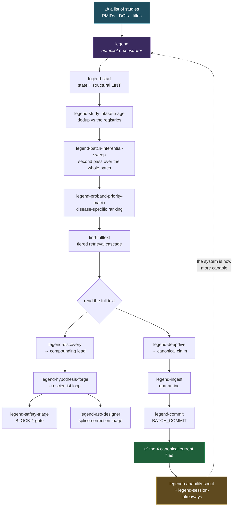

# Skills & agents — what this system can actually do

The reasoning power of LEGEND does not live in one big prompt. It lives in **22 composable skills** and **5 reusable subagents** that call each other in a defined order, each with its own gate, its own output contract and — where it exists — its own runnable code.

This page is the catalogue. It exists because a skill is only useful if you can find it.

> **What is a skill here?** A `SKILL.md` is an executable specification: a named capability with a trigger, a procedure, an output contract and a stop condition. Any agent runtime that reads instruction files can execute one; they are authored for [Claude Code](https://claude.com/claude-code), which discovers them automatically from `.claude/skills/`. Nothing in this repository *requires* an agent runtime — the LINT, the release gate, the analysis pipeline and every regression suite run as plain Python.

## Maturity vocabulary — read this before believing anything below

A capability is not "shipped" because a file describing it exists. Every row carries one of:

| Status | Meaning |
|---|---|
| **BUNDLED** | Specification **and** the code/assets it needs are in this repository — nothing else to install. A row may still note that one optional step reaches a public API. |
| **IMPLEMENTED** | Specification plus runnable code, but it needs input you supply (a paper list, a corpus, a structure). |
| **SPECIFIED** | The procedure is documented and executable by an agent, with no additional code shipped. |
| **EXTERNAL** | Requires a separate install, an API key, or a third-party backend that this repository deliberately does not redistribute. Never auto-authorized. |

This is the `CAPABILITY_CLAIM_MATURITY_GATE` applied to ourselves: see [`framework/eval/learned_gates_registry.md`](framework/eval/learned_gates_registry.md).

---

## The pipeline



The dotted arrow is the point of the whole system: a batch does not only add knowledge, it leaves the machine **more capable of finding the next thing**.

---

## 1 — Orchestration

| Skill | What it does | Status |
|---|---|---|
| [`legend`](.claude/skills/legend/SKILL.md) | The autopilot. Give it a study list and it runs the whole chain — intake → sweep → ranking → retrieval → deep dive → therapeutic fan-out → commit gate → capability growth — stopping only for a category-1 safety signal, a MAJOR baseline reversal, or a paid service. Routes to the external computational workshop through [`officina_routing.md`](.claude/skills/legend/references/officina_routing.md). | SPECIFIED |
| [`legend-start`](.claude/skills/legend-start/SKILL.md) | Session boot: loads the state manifest and the 4 current files, runs the structural LINT, declares `READY` or `BLOCK`. | SPECIFIED |
| [`legend-session-takeaways`](.claude/skills/legend-session-takeaways/SKILL.md) | Mandatory close: what the session *learned*, not what files changed. Compact, tabular, with epistemic tags. | SPECIFIED |
| [`legend-capability-scout`](.claude/skills/legend-capability-scout/SKILL.md) | The evolutionary radar. Every session must leave at least one proportional micro-upgrade of capability. This is the engine behind the compounding claim. | SPECIFIED |
| [`legend-harness-scout`](.claude/skills/legend-harness-scout/SKILL.md) | The weekly harness radar of the Junior Harness Engineer. Mines GitHub, Hugging Face and the Nature portfolio for systems similar to LEGEND, and hands Harness Engineering a candidate table with integration cost in hours and a proposed ADOPT / TRIAL / WATCH / REJECT verdict — implemented at T0, with no Mirror gate (LEGEND_CORE §21e). | SPECIFIED |

## 2 — Intake and triage

| Skill | What it does | Status |
|---|---|---|
| [`legend-study-intake-triage`](.claude/skills/legend-study-intake-triage/SKILL.md) | Bibliographic gate. Normalizes lists from 1 to thousands of records, splits aggregate lines, deduplicates against every registry, disambiguates DOI/PMID/title/year and preprint-vs-published. **Never spend deep-dive effort before this runs.** Ships [`study_dedup_triage.py`](.claude/skills/legend-study-intake-triage/scripts/study_dedup_triage.py) with tests — the dedup itself runs **offline** against your registries; the companion [`retraction_check.py`](.claude/skills/legend-study-intake-triage/scripts/retraction_check.py) queries PubMed. | BUNDLED · retraction check online |
| [`legend-batch-inferential-sweep`](.claude/skills/legend-batch-inferential-sweep/SKILL.md) | The anti-false-negative pass. Scores the *whole* batch for canonical candidates, discovery-only leads, safety signals, repurposing seeds and endpoint seeds — because `OUT_OF_SCOPE_LIKELY` is a queue position, never a verdict. Ships [`batch_inferential_sweep.py`](.claude/skills/legend-batch-inferential-sweep/scripts/batch_inferential_sweep.py); classification is local, PubMed metadata enrichment needs network. | BUNDLED · enrichment online |
| [`legend-proband-priority-matrix`](.claude/skills/legend-proband-priority-matrix/SKILL.md) | Disease-targeted ranking across weighted biological axes — proteostasis, splice/ASO, gene therapy, network/seizure/sleep, myelin/glia, neuroinflammation, metabolism, repurposing, safety. The axes are **data**, in [`proband_priority_matrix.json`](.claude/skills/legend-proband-priority-matrix/references/proband_priority_matrix.json): retune it and the ranking follows. Ships [`score_proband_priority.py`](.claude/skills/legend-proband-priority-matrix/scripts/score_proband_priority.py). | BUNDLED |
| [`legend-ingest`](.claude/skills/legend-ingest/SKILL.md) | Quarantine. Nothing enters the canonical state without passing the inbox first. | SPECIFIED |

## 3 — Acquisition and reading

| Skill | What it does | Status |
|---|---|---|
| [`find-fulltext`](.claude/skills/find-fulltext/SKILL.md) | A tiered retrieval cascade — PMC/NCBI → Unpaywall → Europe PMC → OpenAlex → Semantic Scholar → preprint servers → Scholar PDF links → CORE/BASE → publisher HTML → open web — validating each download is a real full text and reporting which tier worked. Paywalled cases are handed off with author/foundation/ILL routes rather than silently dropped. | SPECIFIED · needs network |
| [`legend-deepdive`](.claude/skills/legend-deepdive/SKILL.md) | The canonical pipeline: group credibility → full text → neutral dossier → deep dive → **COMMIT CANDIDATE**. Enforces a section-by-section coverage map; `grep` is forbidden as a method of analysis. Full procedure in [`deep_dive_manual.md`](framework/manuals/deep_dive_manual.md). | SPECIFIED |
| [`legend-discovery`](.claude/skills/legend-discovery/SKILL.md) | Reads a full text through one lens only: *is there a lead here — even a needle — toward a biomarker, a molecule, or a repurposing?* Grows the cumulative discovery ledger and then pursues its own follow-up searches. This is the compounding engine. | SPECIFIED |
| [`legend-paperqa`](.claude/skills/legend-paperqa/SKILL.md) | Sentence-level cited RAG over a local full-text corpus using PaperQA2, including cross-paper contradiction detection. | EXTERNAL · LLM + embeddings API |

## 4 — From knowledge to action

| Skill | What it does | Status |
|---|---|---|
| [`legend-hypothesis-forge`](.claude/skills/legend-hypothesis-forge/SKILL.md) | The co-scientist loop: generate → critique → rank → evolve, producing 10–30 scored candidate therapeutic hypotheses with a mandatory epistemic tag and a safety gate. Ships a knowledge-graph slice builder, [`kg_thin_slice.py`](.claude/skills/legend-hypothesis-forge/scripts/kg_thin_slice.py) (queries Monarch/DGIdb, so it needs network), and a [ranking rubric](.claude/skills/legend-hypothesis-forge/references/ranking_rubric.md). | IMPLEMENTED · online |
| [`legend-safety-triage`](.claude/skills/legend-safety-triage/SKILL.md) | The BLOCK-1 gate for candidate molecules: ADMET prediction and drug-likeness/structural alerts, with blood–brain-barrier penetration treated as decisive for a CNS target. Predictions are hypotheses in silico, never validation. | EXTERNAL · ADMET-AI / medchem |
| [`legend-aso-designer`](.claude/skills/legend-aso-designer/SKILL.md) | Splice-switching antisense triage: target accessibility (RNA structure, RBP occupancy, conservation), chemistry patterns, gapmer vs SSO — wired into splice-correction logic, not knockdown. Rationale support, never clinical design. | SPECIFIED |

## 5 — Integrity, evolution and navigation

| Skill | What it does | Status |
|---|---|---|
| [`legend-commit`](.claude/skills/legend-commit/SKILL.md) | The only moment the canonical files change. 8 phases, snapshot/restore, all-or-nothing. Ships [`batch_commit.py`](framework/scripts/batch_commit.py). | BUNDLED |
| [`legend-lint-repair-plan`](.claude/skills/legend-lint-repair-plan/SKILL.md) | Turns LINT output into a repair plan grouped by gate impact. Plans only, unless told otherwise. | SPECIFIED |
| [`legend-session-self-eval`](.claude/skills/legend-session-self-eval/SKILL.md) | The diagnosis a session runs on itself, before it is allowed to describe how it went. Runs the executable gate first ([`session_self_eval.py`](framework/scripts/session_self_eval.py), receipt verification, LINT), *then* forces the written judgement against the 27-question protocol, then turns the weakest answer into a proportional micro-upgrade. It exists because the protocol it dispatches was in the repository, with tests, and was not being run — and failed the session on two blocking checks the moment it finally was. | BUNDLED |
| [`legend-locator-audit`](.claude/skills/legend-locator-audit/SKILL.md) | A blind adversarial audit of the quotes behind a reading, before that reading may touch a `consolidated baseline` claim or justify a MAJOR bump. The auditor gets only the `(proposition, quote, anchor)` triples and the source — never the dossier, never who read it — and answers two mechanical questions per triple: does this quote support this proposition, and does the source say more or less than it claims. It exists because a careful, complete, well-executed reading recorded *"NPY: whole hippocampus not significant"* for a paper that reports no statistic there at all, and every structural check passed. Deliberately not applied to every reading: a gate that fires on everything gets switched off. | BUNDLED |
| [`legend-research-loop`](.claude/skills/legend-research-loop/SKILL.md) | Controlled micro-experiments on the system itself: baseline → one variable → predefined success criterion → `KEEP` / `DISCARD` / `INCONCLUSIVE` / `CRASH`. It is how a procedural change earns adoption instead of being adopted on plausibility. | SPECIFIED |
| [`legend-dashboard`](.claude/skills/legend-dashboard/SKILL.md) | Obsidian-friendly status and navigation notes over the Markdown workspace. | SPECIFIED |

## The 5 reusable agents

Skills dispatch bounded work to subagents, each with its own tool scope. They live in [`.claude/agents/`](.claude/agents/) and are verified by [`scripts/test_agent_pipeline_contract.py`](scripts/test_agent_pipeline_contract.py) — a skill may not name an agent that does not exist.

| Agent | Role |
|---|---|
| [`study-intake-triage`](.claude/agents/study-intake-triage.md) | Bibliographic dedup/disambiguation over large lists. |
| [`wwox-scout`](.claude/agents/wwox-scout.md) | Recency-first literature sweep across PubMed and grey literature, returning a triaged candidate list with the source of each hit. |
| [`research-group-analyst`](.claude/agents/research-group-analyst.md) | Assesses the group behind a paper and disambiguates author identity **before** a deep dive, from public sources only. |
| [`fulltext-dossier`](.claude/agents/fulltext-dossier.md) | Neutral structured extraction from a full text — no interpretation, no epistemic verdict. |
| [`legend-deepdive`](.claude/agents/legend-deepdive.md) | Applies the epistemic discipline to a dossier and proposes a complete COMMIT CANDIDATE. Read-only toward every canonical file. |

---

## Runnable without any agent

These are plain Python, standard library only unless noted, and they are what the regression suite exercises:

```bash
python3 framework/scripts/legend_lint.py .                 # structural LINT over the canonical state
python3 framework/scripts/batch_commit.py --help           # the commit machinery
python3 framework/scripts/unread_gold.py --help            # surface high-value unread records
python3 framework/scripts/coverage_report.py --json        # corpus coverage: read vs reading debt
python3 framework/scripts/batch_queue.py --json            # what to read next, against a dated snapshot
python3 framework/scripts/pubmed_clipboard_to_seed.py --help # de-identify a new PubMed Clipboard snapshot
python3 framework/scripts/fulltext_receipts.py validate     # validate the authoritative disease receipt ledger
python3 framework/scripts/generate_semantic_graph.py --help # derive a standalone navigable vault
python3 scripts/public_release_gate.py                     # privacy · provenance · links · clean clone
python3 scripts/run_release_regressions.py                 # every suite at once
```

Analysis-layer tooling (variant structure, KFERQ geometry, molecular-dynamics screens) lives in [`disease-models/wwox/analysis/scripts/`](disease-models/wwox/analysis/scripts/) and is documented in that folder's [README](disease-models/wwox/analysis/README.md).

## Using these on a different disease

The skills in sections 1, 2, 3 and 5 are disease-agnostic; only the axis weights and the disease-model layer are WWOX-specific. See [`framework/ADOPTING.md`](framework/ADOPTING.md).
