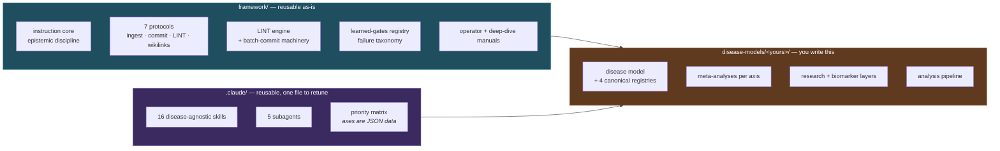

# Adopting LEGEND for another disease

This repository ships one disease model. The engine underneath it is disease-agnostic, and this page is the honest account of what you get for free, what you have to write yourself, and where the work actually is.

It is written for the case that matters most: **a rare disease with a small, descriptive literature, where the mechanism you need is probably published in another field.**

---

## What is generic and what is not



**Genuinely reusable without modification:** the instruction core, the epistemic discipline, all seven protocols, the LINT engine, the batch-commit machinery, the learned-gates registry, both manuals, and 17 of the 21 skills.

**Reusable after retuning one JSON file:** the priority matrix.

**Disease-specific by construction:** three skills (`legend-aso-designer`, and the WWOX framing inside `legend-hypothesis-forge` and `legend-safety-triage`), the entire `disease-models/` layer, and the analysis pipeline.

---

## The path

### 1. Clone and confirm the engine runs

```bash
python3 framework/scripts/legend_lint.py .
python3 scripts/run_release_regressions.py
```

If these are green, the machinery works before you have written a single line about your disease.

### 2. Create the disease layer

```
disease-models/<your-disease>/
├── disease_model.md          # narrative entry point
├── mission.md                # what a win looks like, and the guardrails
├── registries/
│   ├── working_model_current.md          # canonical model + claim mirror + changelog
│   ├── claim_registry_current.md         # numbered claims, each with a status and a source
│   ├── paper_registry_current.md         # papers integrated or baseline-linked
│   └── literature_tracking_log_current.md # lifecycle of every paper seen
├── meta/                      # syntheses per biological axis
├── research/                  # lines, candidates, reading queue, dismissal ledger
├── biomarker_endpoint/        # mechanism-linked markers vs distal clinical endpoints
└── therapeutics/              # scored candidate strategies
```

Use the shipped WWOX files as the reference implementation — they are complete, not stubs.

Then point the LINT at your layer by editing `CURRENTS` in `framework/scripts/legend_lint.py`. Until all four registries exist the engine returns `BLOCK_SYSTEM`, which is the correct signal, not a bug.

### 3. Retune the priority axes

[`proband_priority_matrix.json`](../.claude/skills/legend-proband-priority-matrix/references/proband_priority_matrix.json) is data, not code. Each axis is a label, a weight and a term list. Replace the WWOX axes with the ones that decide *your* reading order — the mutation classes that matter, the therapeutic levers that are plausible for your gene, the safety signals you cannot miss.

Then verify the retune on records you already know the answer for:

```bash
python3 .claude/skills/legend-proband-priority-matrix/scripts/score_proband_priority.py \
  --input your_records.json --out ranked.json
```

Do this with [`legend-research-loop`](../.claude/skills/legend-research-loop/SKILL.md): baseline, one variable, a success criterion decided in advance, then `KEEP` or `DISCARD`. A ranking adopted on plausibility is how a system starts losing papers.

### 4. Seed the compounding memory

Create an empty discovery ledger and dismissal ledger from the shipped templates. They will look pointless for the first two batches. They are the reason the tenth batch is faster than the first: the discovery ledger accumulates leads that no single paper justified, and the dismissal ledger makes every rejection reversible by recording what would resurrect it.

### 5. Run your first batch

Give the autopilot a list of PMIDs and let the chain run. The order is enforced for a reason — triage before retrieval, sweep before ranking, ranking before reading, reading before claiming, claiming before committing.

---

## Four things worth stealing even if you never adopt the rest

If the full framework is more than you need, these transfer on their own:

1. **Tag premises, not only conclusions.** Every rejection names its load-bearing premise and marks it `DATO` / `INFERENZA` / `DEFAULT_FROM_TEXTBOOK`. A textbook default is not a foundation — it is a research target. This one change caught the error that the rest of the discipline was blind to. See [`instruction/epistemic_discipline.md`](instruction/epistemic_discipline.md).

2. **Nothing dies in silence.** Every dismissal records a `REVIVAL_TRIGGER`, and every new mechanistic datum re-scans the dismissal ledger. A false positive gets tested and dies; a false negative is silent, permanent and compounding.

3. **Turn each error into an executable gate.** [`eval/learned_gates_registry.md`](eval/learned_gates_registry.md) holds ~40 reusable gates, each born from a specific mistake. The ones marked `ACTIVE_EXECUTABLE` are enforced by tests in this repository, so the same error cannot return.

4. **Rank to order reading, never to justify not reading.** See [`master/gold_is_in_the_details.md`](master/gold_is_in_the_details.md). A low-priority paper is reading debt, not a discarded source. The single most useful mechanistic finding in the WWOX model came from a thyroid-cancer paper filed `Tier C`.

---

## Boundaries you inherit

Adopting this framework means adopting its refusals.

- **Privacy is structural, not editorial.** Individual-level content lives in a private overlay that is never part of the public repository. The separation is enforced by [`scripts/public_release_gate.py`](../scripts/public_release_gate.py), which checks re-identifying *combinations*, not keywords — the aggregate of individually harmless facts is the attack surface.
- **Nothing is medical advice.** Therapeutic output is material for discussion with a treating clinical team.
- **Predictions are hypotheses.** In-silico output never becomes validation by being repeated.
- **The canonical state changes only through a batch commit**, all-or-nothing, after a LINT gate.

## If you do adopt it

Open an issue describing your disease and what broke. The gaps that show up when someone else instantiates the framework are worth more than anything found by re-reading it here.
